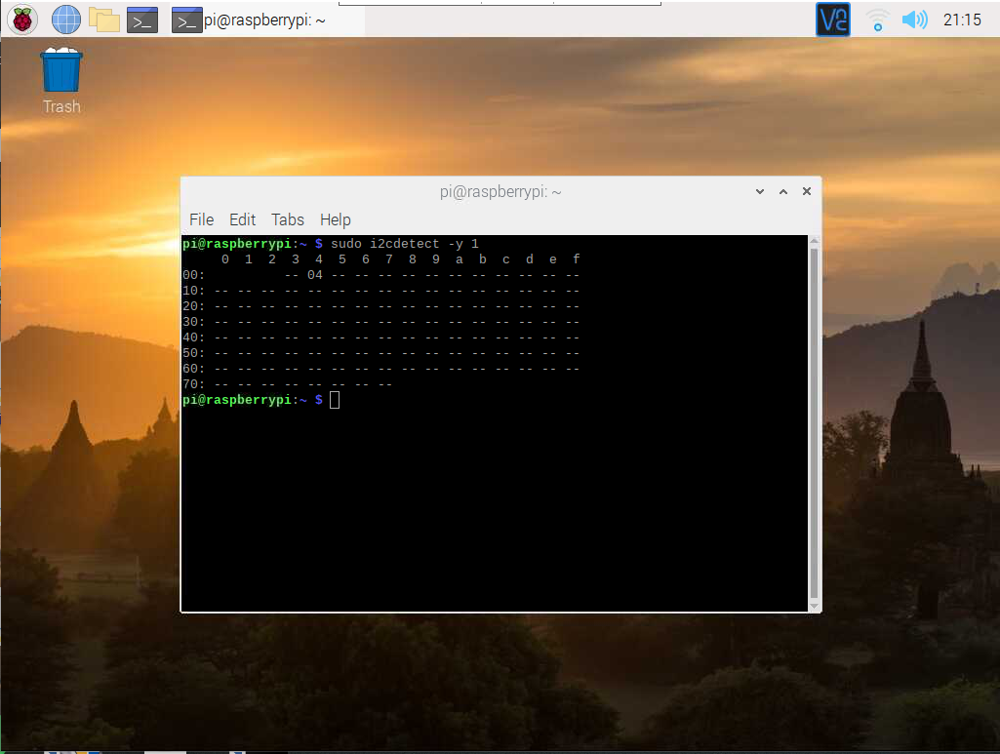
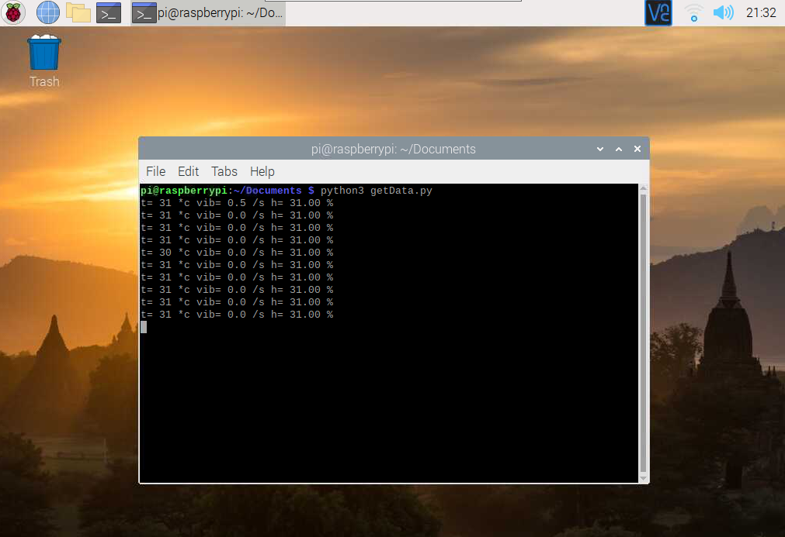

# Connecting Arduino to Raspberry Pi with I2C
This repository is to show how to connect arduino as slave to raspberry pi as master.In this project, three sensors are used. 
## Items required
The things required for this project are:
1. Arduino pro mini
2. Raspberry pi 2
3. LM35 (Temperature sensor)(For analog input)
4. DHT11 (Temperature and humidity sensor)
5. Tilt switch (used as vibration sensor)
6. Jumpers
7. Breadboard
## Connections
##### Connections between Arduino and Sensors:
1. Arduino D11 to tilt switch with 5v and grounded using 220ohm resistor
2. Arduino A0 to LM35 (pin 1 to 5v and pin 3 of LM35 to ground) 
3. Arduino D10 to DHT11 pin 2 (pin 1 to 5v and pin 3 of DHT11 to ground)
##### Connections Between Raspberry pi and Arduino pro mini:
1. Arduino A4 to GPIO 2
2. Arduino A5 to GPIO 3
3. 5V and ground
## Arduino code
Install Arduino IDE and LM35, Wire and DHT libraries before proceeding. Upload the sensorData.ino file to your arduino but before uploading ensure the raspberry pi is disconnected it. The tilt sensor here is used as vibration sensor as it increases the reading of a variable when there is change in state. The temerature from LM35, humidity from DHT11 and change in state value that increases when it senses change in alignment from tilt sensor is sent as a string and written to 0x04 address.
## Raspberry Pi
First, go to raspi-config and enable I2C. 
Now in your Raspberry pi, create a virtual environment using command in Raspberry pi command shell
```
python3 -m venv env
```
Activate the virtual environment created
```
Source ./env/bin/activate
```
And install the following packages
```
sudo apt-get install python-smbus
sudo apt-get install i2c-tools
```
Now attach the arduino to raspberry pi and enter the command in the terminal
```
sudo i2cdetect -y 1
```
If everyting goes correct you have to see this.
<p align="center">
  
 </p>
 
#### Python code
Now run the getData.py file
```
python3 getData.py
```
<p align="center">
  
 </p>
  


